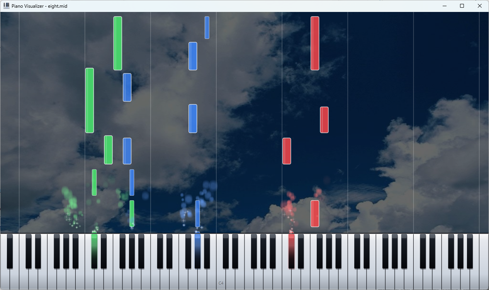
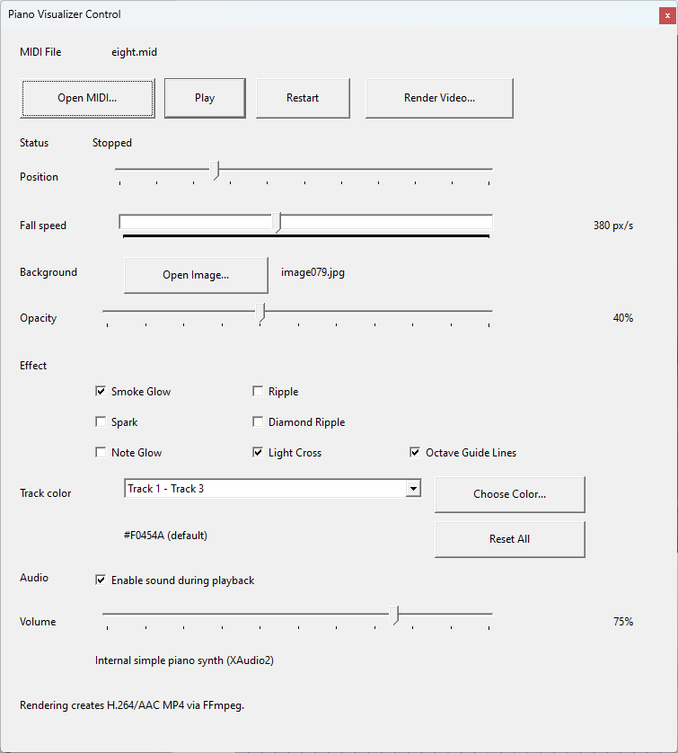

# Piano Visualizer Classic

A lightweight piano MIDI visualizer for Windows.

Piano Visualizer Classic displays MIDI notes as falling notes over an 88-key piano keyboard. It provides configurable visual effects, realtime playback with an internal synthesizer, and MP4 video rendering through FFmpeg.

## Screenshots

### Main Playback Window



### Control Dialog



## Features

- Falling MIDI note visualization
- Full 88-key piano keyboard display
- Velocity-based note and keyboard illumination
- Track-based note colors
- C4 position label
- Optional octave guide lines at B-to-C boundaries
- Background image support with adjustable opacity
- Configurable note fall speed
- Visual effects:
  - Smoke Glow
  - Light Cross
  - Spark
  - Ripple
  - Diamond Ripple
  - Note Glow
- Realtime MIDI playback with an internal XAudio2 synthesizer
- Playback audio can be enabled or disabled independently of the visualizer
- MP4 video rendering through FFmpeg
- Optional audio track in rendered videos
- Render progress and cancellation support
- Resolution-independent video rendering

## Requirements

- Windows 10 or later
- Visual Studio with C++ desktop development tools
- Windows SDK
- FFmpeg (`ffmpeg.exe`) for MP4 video rendering

The included project uses the Visual Studio C++ toolset (`v145`). CMake is not required.

## Building

Open the following solution in Visual Studio:

```text
PianoVisualizer.sln
```

Use:

```text
Configuration: Release
Platform: x64
```

Build the project from Visual Studio. The Release executable is generated at:

```text
bin\x64\Release\PianoVisualizerClassic.exe
```

## Running

Piano Visualizer Classic does not require an installer. Run `PianoVisualizerClassic.exe` directly.

Open a Standard MIDI File (`.mid` or `.midi`) from the control window, then adjust the playback position, note fall speed, background, effects, colors, and audio settings as needed.

## FFmpeg

FFmpeg is required only for MP4 video rendering. `ffmpeg.exe` is not included in this repository.

Piano Visualizer Classic searches for FFmpeg in the following locations:

1. Next to `PianoVisualizerClassic.exe`
2. A directory listed in the system `PATH`

When FFmpeg is unavailable, realtime MIDI visualization and playback remain available; only video rendering is disabled.

Video frames are sent directly to FFmpeg as BGRA data, so no temporary image sequence is required. When audio is included, Piano Visualizer Classic creates a temporary WAV file and FFmpeg combines it with the rendered video.

## MIDI Playback

Piano Visualizer Classic loads Standard MIDI Files and converts MIDI timing to seconds using the MIDI file's tempo information.

Only notes within the visible 88-key piano range (MIDI notes 21–108) are displayed.

The internal synthesizer is intentionally lightweight. It is designed to provide convenient playback for the visualizer rather than to reproduce a high-end acoustic piano in detail.

## Video Rendering

Video rendering runs on a worker thread so that the main application window remains responsive.

The video renderer uses a separate Direct2D/WIC rendering context from the realtime playback window. The rendered frames are generated from fixed video timestamps, independent of the speed of the realtime UI loop.

The render dialog provides options including:

- Video width
- Video height
- Output file
- Include audio

The current visualizer settings are used when rendering the video, including effects, track colors, background image, octave guide lines, and fall speed.

## Controls

The control dialog provides settings for playback and visualization, including:

- Fall Speed
- Background image
- Background opacity
- Visual effects
- Track colors
- Playback audio and volume
- Octave guide lines
- Video rendering

Several settings can be changed while playback is running.

## License

Piano Visualizer Classic is released under the MIT License.

See `LICENSE` for details.
